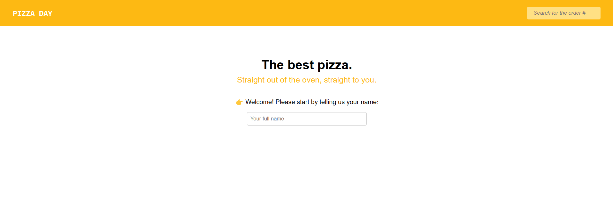
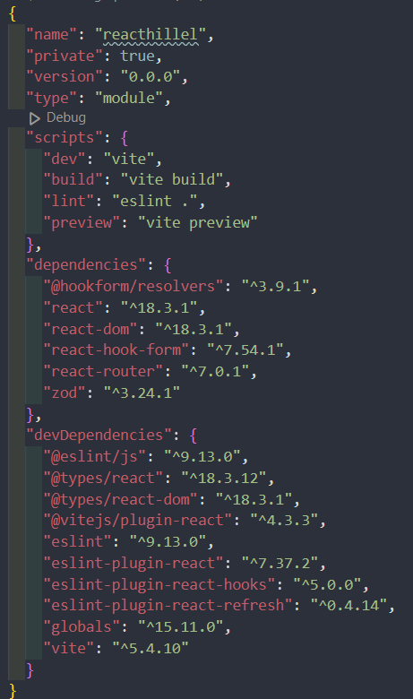

# Pizza Day - Pizza Delivery (React.js)

This project is my second experience with React.

>This project was created to study new concepts and reinforce existing knowledge of React in practice.

In this project, I learned how to use [React Hook Form](https://www.react-hook-form.com/) and [Zod](https://www.npmjs.com/package/zod), how to create custom hooks, improved my skills with createContext/useContext and other hooks, discovered lazy() and Suspense, and worked with REST API.
I also used the desktop-first method to diversify my projects. Usually, I prefer mobile-first.

**[==> View website](https://resplendent-hotteok-54ec2d.netlify.app/)**

## Summary

* [Philosophy](#philosophy)
* [Licence](#licence)
* [Tools](#tools)
* [Installation](#installation)
* [Contacts](#contact-me)

## Philosophy
My favorite method, which I try to adhere to:

* [KISS](https://en.wikipedia.org/wiki/KISS_principle)

## Licence

Was created under the [MIT Licence](./LICENSE)

## Tools

 React 
 JSX 
 CSS 
 Vite 

## Installation

To work with this project you will need **GIT**, **NPM** and **Node.js**

**[==>How to install Git](https://git-scm.com/book/en/v2/Getting-Started-Installing-Git)**

**[==>How to install Node.js and NPM](https://docs.npmjs.com/downloading-and-installing-node-js-and-npm)**

### Local installation:

1. On the command line, navigate to the folder where the project will be deployed. Then copy it from GitHub :

`$ git clone https://github.com/saintgregoire/ReactHillel.git`

**While in the working directory in the terminal command line:** 

2. Installing dependencies:

`$ npm i `

## Contact me

